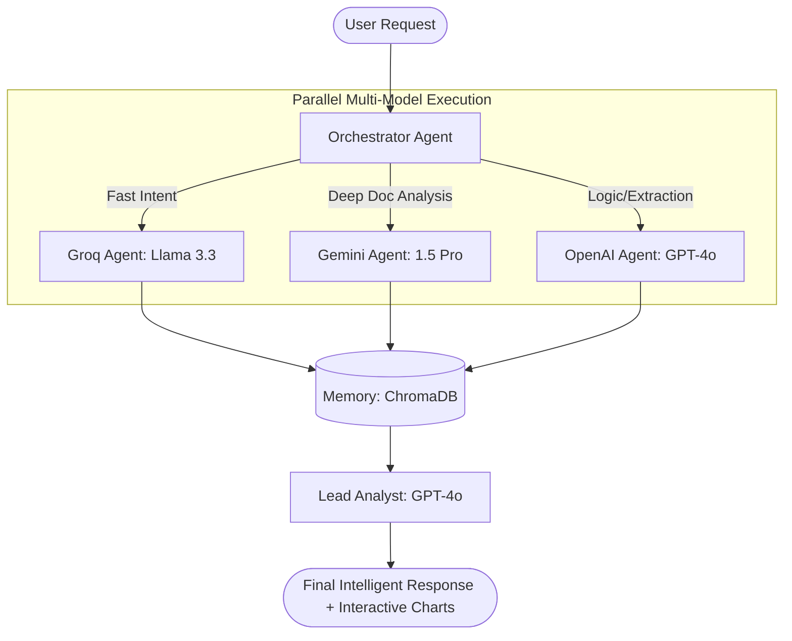

# 🚀 Documind: Next-Gen Autonomous Financial Intelligence Workstation

[](https://github.com/Thorat-Kaustubh/Documind)
[](LICENSE)
[](https://www.python.org/)
[](https://reactjs.org/)

> **Documind** is a high-performance, autonomous financial intelligence platform that leverages specialized **Multi-Model Orchestration** (Groq, Gemini, OpenAI) to synthesize deep market insights, analyze massive regulatory filings, and provide real-time monitoring of the financial landscape.

---

### ⚠️ Active Development Note
**This project is actively being improved with new features and optimizations.** 
We are currently in a high-velocity phase, integrating neural indexing and advanced visual intelligence engines to redefine the financial analyst's workflow.

---

## 🌟 Key Features

- **🧠 Multi-Model Brain**: Intelligent task routing across **Groq**, **Gemini**, and **OpenAI** to optimize for latency, context length, and logical reasoning.
- **📈 Visual Intelligence Engine**: Transforms raw LLM data into interactive, production-ready charts using **Recharts** and tailored JSON schemas.
- **🏢 Deep Document Synthesis**: Massive context window support (Gemini 1.5 Pro) for analyzing 200+ page annual reports, historical filings, and complex technical charts.
- **⚡ Autonomous Market Heartbeat**: Background "Observer" agents that monitor Nifty 50, alert on volume shocks, and provide real-time sentiment scoring.
- **🕸️ High-Speed Data Extraction**: Firecrawl-powered scraping that converts complex financial news and regulatory pages into clean, LLM-ready Markdown in milliseconds.
- **💎 Bloomberg Dark UI**: A premium, "glassmorphism" interface built with **Framer Motion** and **Tailwind CSS** for a professional financial experience.

---

## 🏗️ Technical Architecture

Documind operates on a "Super-Agent" architecture where specialized models handle specific cognitive tasks based on their inherent strengths.

| Model | Specialty | Mission Critical Task |
| :--- | :--- | :--- |
| **Groq (Llama 3.3)** | **Extreme Latency** | Instant Intent Routing, Live Sentiment Scoring, Market Pulse Summaries. |
| **Gemini (1.5 Pro)** | **Massive Context** | Annual Report Deep-Dives (200+ Pages), Historical Trend Synthesis, Visual Pattern Recognition. |
| **OpenAI (GPT-4o)** | **Logic & Extraction** | Structured JSON Entity Extraction, "Lead Analyst" Final Synthesis & Reasoning. |

### The Orchestrator Workflow


---

## 🛠️ Tech Stack

- **Backend**: Python 3.10+, FastAPI (Asynchronous Orchestration), Celery (Background Processing).
- **LLM Orchestration**: LangChain, CrewAI, Custom Multi-LLM Broker (`ai_broker.py`).
- **Database & Memory**: **PostgreSQL (Supabase)** for metrics, **ChromaDB** for vector memory.
- **Scraping Fleet**: Firecrawl API, modular Scrapy agents.
- **Frontend**: React, Tailwind CSS, Framer Motion, Recharts.

---

## 🚀 Getting Started

### 1. Clone the Repository
```bash
git clone https://github.com/Thorat-Kaustubh/Documind.git
cd Documind
```

### 2. Configure Environment
Create a `.env` file in the root directory and add your API keys:
```env
OPENAI_API_KEY=your_key
GEMINI_API_KEY=your_key
GROQ_API_KEY=your_key
FIRECRAWL_API_KEY=your_key
SUPABASE_URL=your_url
SUPABASE_SERVICE_ROLE_KEY=your_key
```

### 3. Start the Backend
```bash
cd backend
pip install -r requirements.txt
python main.py
```

### 4. Launch the Frontend
```bash
cd frontend
npm install
npm run dev
```

---

## 📊 Roadmap
- [x] Phase 1: Foundation & Scraping Fleet (Firecrawl Integration)
- [x] Phase 2: Multi-LLM Broker & Brain (Task Routing Logic)
- [ ] Phase 3: Visual Intelligence Engine (Common JSON Chart Schemas)
- [ ] Phase 4: Autonomous Market Heartbeat (Real-time Nifty 50 Monitoring)

---

## 📄 License
This project is licensed under the [MIT License](LICENSE).

---

<p align="center">
  Built with ❤️ for the future of financial intelligence.
</p>
