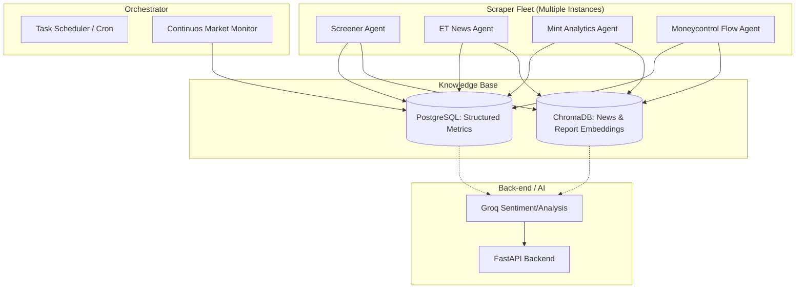

# Implementation Plan: Documind Autonomous Financial Engine

## 1. Goal
Build a scalable, multi-instance scraping and monitoring system that:
- Runs parallel "Agents" for different data sources (Screener, ET, Livemint, Moneycontrol).
- Continuously monitors live markets and news.
- Populates a hybrid database (Structured + Vector) to build an ever-growing Financial Knowledge Base.

## 2. Architecture: "The Documind Pipeline"

## 3. Core Components

### A. The Scraper Agents (Modular & Scalable)
- **Framework**: Use `Playwright` or `HTTPX` (for speed).
- **Isolation**: Each scraper is a separate class/module, making it easy to launch multiple instances without interference.
- **Rotation**: Ability to handle rate limits and cookies per site.

### B. Continuous Monitor (The "Observer")
- **Frequency**: Every 5-15 minutes.
- **Trigger**: New headlines, price spikes, or regulatory filings on SEBI.
- **Logic**: If "Alert Condition" met -> Trigger deep scrape.

### C. Knowledge Base Sync
- **Historical**: One-time deep catch-up for 10-year data (from Screener Excel).
- **Incremental**: Daily deltas (End of day prices + Latest News).

## 4. Proposed Tech Stack Updates
- **Queuing**: `Celery` + `Redis` (for distributed task launching).
- **Scheduling**: `APScheduler` (for periodic heartbeats).
- **Vector DB**: `ChromaDB` or `Pinecone` for storing news sentiment embeddings.
- **Web Interaction**: `Playwright` (for modern JavaScript-heavy sites like Moneycontrol).

## 5. Phase 1 Implementation Steps
1. **Scraper Base Class**: Create a generic `BaseScraper` with error handling and DB logging.
2. **Launch Controller**: A simple FastAPI endpoint `/launch-scrapers` that starts background threads for parallel scraping.
3. **Database Schema Update**: Add tables for `MarketNews`, `StockMetricsHistory`, and `SystemLogs`.
4. **Integration**: Connect the `Monitor` instance to the `Groq` intelligence engine to auto-summarize news as they come in.

---
*Status: Ready for Code Implementation*
