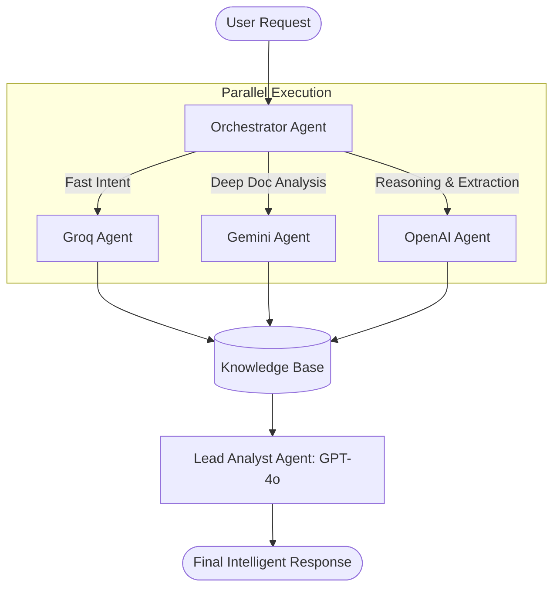

# Architecture: Documind Multi-LLM Orchestrator

This plan outlines how to leverage the specialized strengths of **Groq**, **Gemini**, and **OpenAI** to create a "Super-Agent" for financial intelligence.

## 1. The Multi-LLM Strategy

| Model | Specialty | Documind Task |
| :--- | :--- | :--- |
| **Groq (Llama 3.3)** | **Speed & Latency** | - **Intent Prediction**: Routing user queries in milliseconds.<br>- **Live Sentiment**: Instant scoring of news headlines from the monitors.<br>- **Summarization**: Quick summaries of market moves. |
| **Gemini (1.5 Pro)** | **Huge Context Window** | - **Annual Report Analysis**: Reading massive 200+ page PDF filings.<br>- **Historical Synthesis**: Comparing trends across 10 years of data.<br>- **Vision**: Analyzing financial charts and technical patterns from images. |
| **OpenAI (GPT-4o)** | **Logic & Reasoning** | - **Entity Extraction**: Turning messy scraped text into perfectly structured JSON.<br>- **Final Synthesis**: Acting as the "Lead Analyst" to combine data from all sources into a final premium response. |

---

## 2. Agent Workflow Diagram



---

## 3. Implementation Steps

### A. The "Unified Provider" Interface
Create an `ai_broker.py` that abstracts the API calls:
```python
class AIBroker:
    def call_groq(self, prompt): ...
    def call_gemini(self, prompt, files=None): ...
    def call_openai(self, prompt, response_format="json"): ...
```

### B. Task Routing Logic
Update the [intent_router.py](file:///d:/Documind_Major-main/backend/intent_router.py) to not just find the "intent," but also assign the "Computing Provider":
- If `intent == "annual_report_lookup"` -> **Gemini**.
- If `intent == "current_price"` -> **Groq**.
- If `intent == "complex_valuation"` -> **OpenAI**.

### C. Knowledge Consolidation
- Use the **Vector Database (ChromaDB)** as the shared memory where all three models can "write" their findings.
- The **Lead Analyst Agent** (GPT-4o) reads this shared memory to generate the final response.

---
*Status: Architecture Defined. Ready to integrate API keys and build the Broker.*
